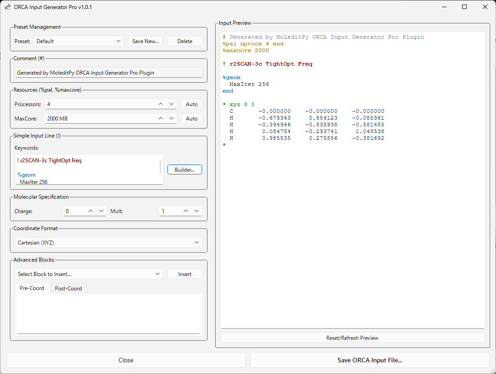
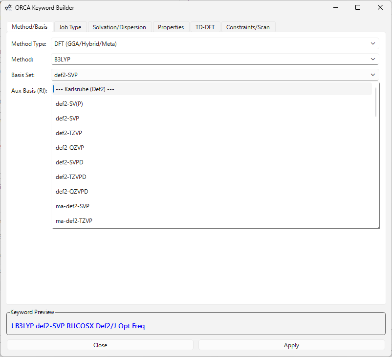

# MoleditPy ORCA Input Generator Pro

An advanced **ORCA Input Generator** plugin for **MoleditPy**, designed to streamline the creation of high-quality ORCA calculation files with a focus on usability, automation, and interactive 3D tools.

Repo: https://github.com/HiroYokoyama/moleditpy_orca_input_generator_pro

---

## Key Features

- **Intuitive Job Builder**: A tabbed interface for easy configuration of Methods, Basis Sets, Job Types, Solvation, and Properties.
- **Extensive Libraries**: Built-in support for a vast range of DFT (GGA, Hybrid, Meta, Range-Separated, Double Hybrid), Wavefunction (HF, MP2, Coupled Cluster, Multireference), and Semi-empirical methods.
- **Interactive Constraints & Scans**: Use the 3D viewer to pick 1-4 atoms and instantly define constraints (Position, Distance, Angle, Dihedral) or coordinate scans.
- **Real-time Preview**: Instantly see the generated job keywords and the full ORCA input file as you make changes.
- **Intelligent Automation**:
  - Automatically deduplicates keywords.
  - Handles specialized resource blocks like `%pal` and `%maxcore`.
  - Simplifies complex options like TD-DFT, Solvation (CPCM, SMD), and Dispersion corrections (D3BJ, D4).
- **Custom Syntax Highlighting**: Enhanced readability for `.inp` files with specialized coloring for keywords, blocks, and resource headers.

---

## Installation

1. Ensure you have MoleditPy installed.
2. Download the [plugin](https://hiroyokoyama.github.io/moleditpy-plugins/explorer/?q=ORCA+Input+Generator+Pro) into your MoleditPy plugins directory.
3. Restart MoleditPy, and the **ORCA Input Generator Pro** will be available in the plugins menu.

---

## Usage

1. Open a molecule in MoleditPy.
2. Launch the **ORCA Input Generator Pro** from the menu.
4.  Review the **Input Preview** to verify your setup.
5.  Click **Save ORCA Input File...** to finalize your job.

---

## Interactive Constraints & Scans

The **Keyword Builder** provides powerful 3D interactive tools for defining structural constraints and coordinate scans:

1.  Navigate to the **Scan/Constraint** tab in the Keyword Builder.
2.  Picking mode is automatically enabled for this tab.
3.  **Click atoms** in the MoleditPy 3D viewer to select them:
    -   **1 Atom**: Position Constraint (Fixed atom).
    -   **2 Atoms**: Distance Constraint/Scan.
    -   **3 Atoms**: Angle Constraint/Scan.
    -   **4 Atoms**: Dihedral Constraint/Scan.
4.  Selected atoms are highlighted with labels in the 3D scene.
5.  Click **Add Constraint** to insert the selection into the table.
6.  **Coordinate Scans**: 
    -   Check the **Scan?** column for any constraint.
    -   Define the **Start**, **End**, and **Steps** for the scan.
    -   The plugin automatically generates the correct `%geom ... Scan ... end` blocks.

---

## Dependencies

- **PyQt6**: For the modern graphical user interface.
- **RDKit**: For molecular geometry and property handling.
- **NumPy**: For coordinate calculations and analysis.

---

## License

This project is licensed under the GPLv3 License - see the [LICENSE](LICENSE) file for details.

