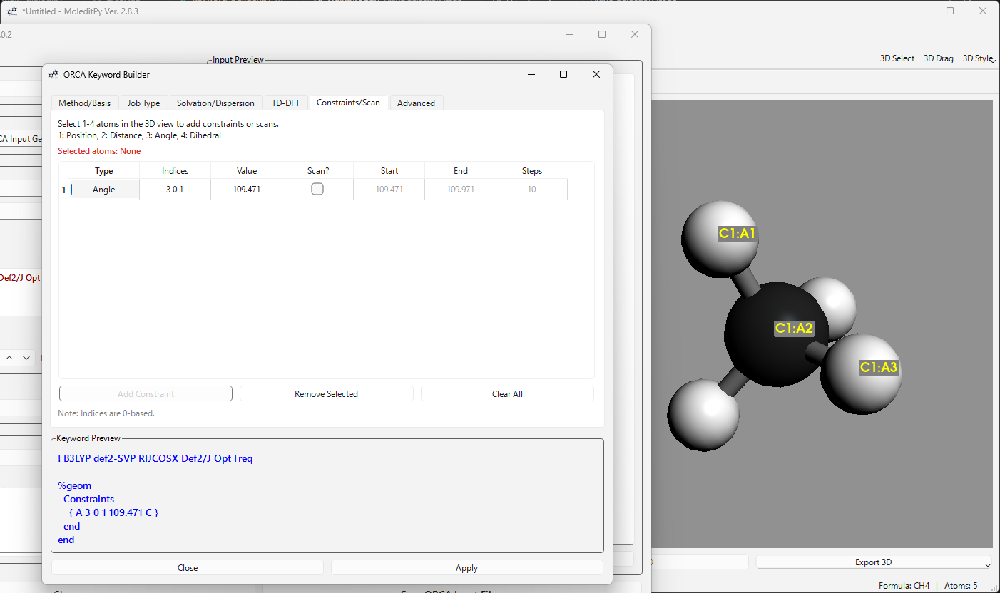

# MoleditPy ORCA Input Generator Pro

An advanced **ORCA Input Generator** plugin for **MoleditPy**, designed to streamline the creation of high-quality ORCA 5/6 calculation input files with a focus on usability, automation, and interactive 3D tools.

Repo: [https://github.com/HiroYokoyama/moleditpy_orca_input_generator_pro](https://github.com/HiroYokoyama/moleditpy_orca_input_generator_pro)

---

## Key Features

- **Comprehensive Keyword Builder** — tabbed GUI covering methods, job types, solvation, dispersion, TD-DFT, constraints, and all advanced options
- **Real-time Preview** — generated keyword line and full `.inp` file update instantly as you make changes
- **Round-trip Parsing** — open an existing `.inp` file and all settings are restored into the UI
- **Interactive Constraints & Scans** — click atoms in the MoleditPy 3D viewer to define distance/angle/dihedral constraints or coordinate scans
- **22 Block Templates** — one-click insertion of annotated `%block ... end` stubs for every major ORCA block
- **Syntax Highlighting** — `.inp` files get colour-coded keywords, blocks, and resource headers
- **Session Persistence** — last-used settings are saved and restored between sessions
- **599 automated tests** across all features

---

## Job Types

| Job | ORCA keyword |
|-----|-------------|
| Single Point | *(default)* |
| Geometry Optimisation | `Opt` |
| Frequency | `Freq` |
| Opt + Freq | `Opt Freq` |
| Gradient (SP + forces) | `EnGrad` |
| Numerical Gradient | `NumGrad` |
| Numerical Hessian | `NumHess` |
| Transition State | `OptTS` |
| IRC | `IRC` |
| NMR | `NMR` |
| Vibronic Absorption | `ESD(ABS)` |
| Vibronic Fluorescence | `ESD(FLUOR)` |
| Gradient (general) | `Gradient` |
| Hessian (general) | `Hessian` |

---

## Supported Methods

### DFT
- **GGA**: BLYP, BP86, PBE, revPBE, OLYP, …
- **Hybrid**: B3LYP, PBE0, TPSSh, B3PW91, CAM-B3LYP, ωB97X-D3, M06-2X, …
- **Meta-GGA / meta-Hybrid**: TPSS, M06-L, r2SCAN, …
- **Double Hybrid**: B2PLYP, RI-B2PLYP, PWPB95, …
- **3c composites**: B97-3c, r2SCAN-3c, HF-3c

### Wavefunction
- HF, MP2, RI-MP2
- CCSD, CCSD(T)
- DLPNO-MP2, DLPNO-CCSD(T), DLPNO-CCSD(T1)
- DLPNO-CCSD(T)-F12 with CABS basis
- CASSCF, NEVPT2, MRCI, MR-MP2

### Relativistic
- ZORA, IORA, DKH2, X2C (via `%rel` block)

### PNO Control
- LoosePNO / NormalPNO / TightPNO

---

## Basis Sets & Auxiliary Bases

- def2-SV(P), def2-SVP, def2-TZVP, def2-TZVPP, def2-QZVPP
- cc-pVDZ/TZ/QZ, aug-cc-pVDZ/TZ, cc-pVDZ-F12, cc-pVTZ-F12
- Pople 6-31G(d), 6-311+G(d,p), …
- Aux: Def2/J, Def2/JK, cc-pVDZ-F12-CABS, cc-pVTZ-F12-CABS
- Custom MOREAD (MO file path parsed from/to route)

---

## SCF Options

| Feature | Details |
|---------|---------|
| Convergence threshold | SloppySCF → ExtremeSCF |
| Damping | SlowConv, VerySlowConv |
| Initial guess | Default / PModel / Hueckel / HCore / PAtom / MOREAD |
| RI approximation | RIJCOSX, RI |
| Chain-of-spheres exchange | COSX (without RI Coulomb) |
| Broken-symmetry DFT | UKS + `%scf BrokenSym n,m end` |

---

## Properties

| Property | Keyword |
|----------|---------|
| Natural Bond Orbital | NBO |
| Natural Population Analysis | NPA |
| ChElPG charges | ChElPG |
| Hirshfeld / CM5 charges | Hirshfeld |
| Uncoupled MOs | UCO |
| Natural UHF orbitals | UNO |
| Singly-occupied MOs | SOMO |
| Fractional occupation density | FOD |
| Optical rotation | OptRot |
| Polarizability | Polarizability |
| Hyperpolarizability | Hyperpol |
| EPR parameters | EPR |
| Zero-field splitting | ZFS |
| Spin-orbit coupling integrals | RI-SOMF(1X) |
| No RI in properties | NoRI |
| FrozenCore / NoFrozenCore | FrozenCore / NoFrozenCore |
| Print level | LargePrint / MiniPrint / PrintBasis |
| File retention | KeepDens / KeepInts |

---

## TD-DFT

- Number of roots, target root (IRoot)
- Triplet states toggle
- Tamm-Dancoff Approximation (TDA)
- VCD (`doVCD true`) and ROA (`doROA true`) via `%freq` block

---

## Solvation & Dispersion

- **Implicit solvation**: CPCM, SMD (with solvent selection)
- **Dispersion corrections**: D2, D3BJ, D3Zero, D4, NL

---

## Block Templates

One-click insertion of annotated templates for all 22 major ORCA blocks:

`%output` · `%eprnmr` · `%scf` · `%geom` · `%elprop` · `%plots` · `%tddft` · `%cis` · `%rocis` · `%mrci` · `%casscf` · `%mdci` · `%neb` · `%md` · `%compound` · `%basis` · `%cpcm` · `%rel` · `%mp2` · `%dft` · `%frag` · `%freq` · `%loc` · `%esd`

Each template includes inline comments explaining every sub-keyword and common options.

---

## Interactive Constraints & Scans

1. Open the **Constraints/Scan** tab in the Keyword Builder.
2. Click atoms in the MoleditPy 3D viewer:
   - **1 atom** → position constraint
   - **2 atoms** → distance constraint/scan
   - **3 atoms** → angle constraint/scan
   - **4 atoms** → dihedral constraint/scan
3. Selected atoms are highlighted with labels in the 3D scene.
4. Click **Add Constraint** to insert into the table.
5. Check the **Scan?** column and set Start/End/Steps to run a coordinate scan.

The plugin generates the correct `%geom Constraints ... end` and `%geom Scan ... end` blocks automatically.

---

## Installation

1. Ensure MoleditPy is installed.
2. Download the plugin from the [MoleditPy Plugin Explorer](https://hiroyokoyama.github.io/moleditpy-plugins/explorer/?q=ORCA+Input+Generator+Pro) into your MoleditPy plugins directory.
3. Restart MoleditPy — **ORCA Input Generator Pro** will appear in the Plugins menu.

---

## Usage

1. Open a molecule in MoleditPy.
2. Launch **ORCA Input Generator Pro** from the Plugins menu.
3. Configure your calculation in the tabbed settings panel.
4. Review the **Input Preview** on the left — it updates in real time.
5. Click **Save ORCA Input File…** to write the `.inp` file.

To load an existing input file: use **Open…** and all settings will be restored from the file.

---

## Dependencies

- **PyQt6** — graphical interface
- **RDKit** — molecular geometry and property handling
- **NumPy** — coordinate calculations

---

## License & Disclaimer

Licensed under the GNU General Public License v3.0 — see [LICENSE](LICENSE) for details.
Provided *as is* without warranty. Users are responsible for validating outputs before use in publications or production workflows. Please [open an issue](https://github.com/HiroYokoyama/moleditpy_orca_input_generator_pro/issues) if you find a bug.
